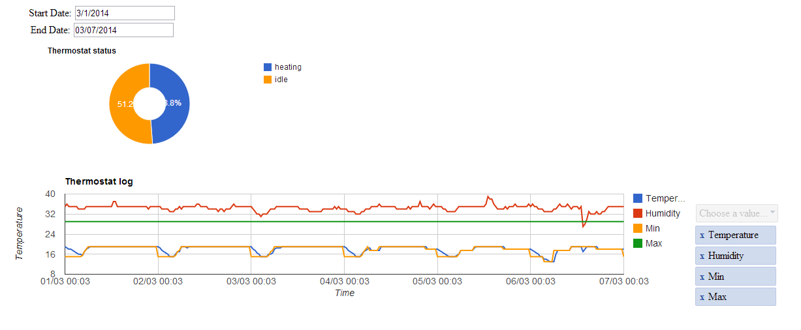

LennoxThermoPi
==============

Log data from your Lennox iComfort thermostat.

Since Lennox don't provide any public API to communicate with the iComfort thermostat, I created the following.

get_page.py
--------------

This will grab the iComfort web page and log to a text file the relavant information. 
Currently it will log:

- current temperature
- minimum set (A/C)
- maximum set (Heating)
- humidity
- satus (HEATING, COOLING, IDLE)

Note you will need to create your own cookie.txt file, to authenticate to the lennox dashboard of your thermostat.
I used something like:
https://addons.mozilla.org/en-us/firefox/addon/cookie-exporter/

Then just set this python script to run at a given interval. For example I have this setup as a cron job to run every 30 minutes.

index.html
--------------

This is a simple html page that uses the Google Graph API to allow you to do your plots.
An example from this page is shown below

